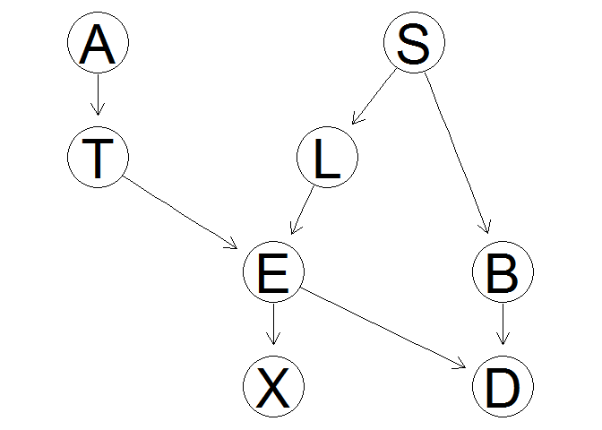
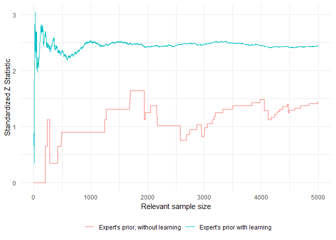

## Prequential diagnostic monitors for Bayesian Networks

Package exists to check the goodness of fit for a BN model. Package is designed to interface with objects of class bnlearn. 


```r
devtools::install_github('bnmonitoR','rachwhatsit')
```

Load the package from github.

```r
library(bnmonitoR)
```

We will examine the dataset from the bnlearn package from Lauritzen. Details of the variables (nodes) can be found in the documentation for bnlearn.

```r
data(asia)
summary(asia)
```

```
##    A          S          T          L          B          E       
##  no :4958   no :2485   no :4956   no :4670   no :2451   no :4630  
##  yes:  42   yes:2515   yes:  44   yes: 330   yes:2549   yes: 370  
##    X          D       
##  no :4431   no :2650  
##  yes: 569   yes:2350
```

We will specify the structure of the model here. This corresponds to the candidate model from Cowell et al. pg 240

```r
asia.dag = model2network("[A][S][T|A][L|S][B|S][D|B:E][E|T:L][X|E]") #this is the candidate model from pg 240
bnlearn::graphviz.plot(asia.dag)
```

<!-- -->

### Global monitor

The global monitor is equivalent to the Bayes Factor and offers a good assessment of the model as a whole.

```r
global.monitor.tbl(asia.dag, alpha = 2, df=asia)
```

```
## Warning: `as_tibble.matrix()` requires a matrix with column names or a `.name_repair` argument. Using compatibility `.name_repair`.
## This warning is displayed once per session.
```

```
## # A tibble: 8 x 2
##   V1    node.scores
##   <chr>       <dbl>
## 1 A          -248. 
## 2 B         -3021. 
## 3 D         -2144. 
## 4 E           -19.6
## 5 L         -1100. 
## 6 S         -3470. 
## 7 T          -258. 
## 8 X          -849.
```

The darker colors correspond to nodes with a greater contribution to the Bayes Factor. 

```r
global.monitor.graph(asia.dag, alpha = 2, df=asia)
```

<!--html_preserve--><div id="htmlwidget-075ded7f105a4d7b1e0b" style="width:672px;height:480px;" class="grViz html-widget"></div>
<script type="application/json" data-for="htmlwidget-075ded7f105a4d7b1e0b">{"x":{"diagram":"digraph {\n\ngraph [layout = \"neato\",\n       outputorder = \"edgesfirst\",\n       bgcolor = \"white\",\n       label = \"Global Monitors\",\n       labelloc = \"t\",\n       labeljust = \"c\",\n       fontname = \"Helvetica\",\n       fontcolor = \"gray30\"]\n\nnode [fontname = \"Helvetica\",\n      fontsize = \"10\",\n      shape = \"circle\",\n      fixedsize = \"true\",\n      width = \"0.5\",\n      style = \"filled\",\n      fillcolor = \"aliceblue\",\n      color = \"gray70\",\n      fontcolor = \"gray50\"]\n\nedge [fontname = \"Helvetica\",\n     fontsize = \"8\",\n     len = \"1.5\",\n     color = \"gray80\",\n     arrowsize = \"0.5\"]\n\n  \"1\" [label = \"A\", style = \"filled\", fontcolor = \"black\", fillcolor = \"#EAF3FB\", pos = \"0,4!\"] \n  \"2\" [label = \"B\", style = \"filled\", fontcolor = \"black\", fillcolor = \"#1E6CB1\", pos = \"2,3!\"] \n  \"3\" [label = \"D\", style = \"filled\", fontcolor = \"black\", fillcolor = \"#5DA4D0\", pos = \"2,1!\"] \n  \"4\" [label = \"E\", style = \"filled\", fontcolor = \"black\", fillcolor = \"#F6FAFE\", pos = \"0.5,2!\"] \n  \"5\" [label = \"L\", style = \"filled\", fontcolor = \"black\", fillcolor = \"#BDD7EB\", pos = \"1,3!\"] \n  \"6\" [label = \"S\", style = \"filled\", fontcolor = \"black\", fillcolor = \"#084594\", pos = \"1.5,4!\"] \n  \"7\" [label = \"T\", style = \"filled\", fontcolor = \"black\", fillcolor = \"#EAF2FA\", pos = \"0,3!\"] \n  \"8\" [label = \"X\", style = \"filled\", fontcolor = \"black\", fillcolor = \"#CCDFF1\", pos = \"0.5,1!\"] \n  \"6\"->\"2\" \n  \"2\"->\"3\" \n  \"4\"->\"3\" \n  \"5\"->\"4\" \n  \"7\"->\"4\" \n  \"6\"->\"5\" \n  \"1\"->\"7\" \n  \"4\"->\"8\" \n}","config":{"engine":"dot","options":null}},"evals":[],"jsHooks":[]}</script><!--/html_preserve-->
 

```r
asia.dag.model0 = model2network("[A][S][T|A][L|S][B|S][E|T:L][X|E][D|B:E:S]") #this is the candidate model from pg 240
global.monitor.tbl(asia.dag.model0, alpha = 2, df=asia)
```

```
## # A tibble: 8 x 2
##   V1    node.scores
##   <chr>       <dbl>
## 1 A          -248. 
## 2 B         -3021. 
## 3 D         -2153. 
## 4 E           -19.6
## 5 L         -1100. 
## 6 S         -3470. 
## 7 T          -258. 
## 8 X          -849.
```

```r
global.monitor.graph(asia.dag.model0, alpha = 2, df=asia)
```

<!--html_preserve--><div id="htmlwidget-e30dde15784b9deb7d55" style="width:672px;height:480px;" class="grViz html-widget"></div>
<script type="application/json" data-for="htmlwidget-e30dde15784b9deb7d55">{"x":{"diagram":"digraph {\n\ngraph [layout = \"neato\",\n       outputorder = \"edgesfirst\",\n       bgcolor = \"white\",\n       label = \"Global Monitors\",\n       labelloc = \"t\",\n       labeljust = \"c\",\n       fontname = \"Helvetica\",\n       fontcolor = \"gray30\"]\n\nnode [fontname = \"Helvetica\",\n      fontsize = \"10\",\n      shape = \"circle\",\n      fixedsize = \"true\",\n      width = \"0.5\",\n      style = \"filled\",\n      fillcolor = \"aliceblue\",\n      color = \"gray70\",\n      fontcolor = \"gray50\"]\n\nedge [fontname = \"Helvetica\",\n     fontsize = \"8\",\n     len = \"1.5\",\n     color = \"gray80\",\n     arrowsize = \"0.5\"]\n\n  \"1\" [label = \"A\", style = \"filled\", fontcolor = \"black\", fillcolor = \"#EAF3FB\", pos = \"0,4!\"] \n  \"2\" [label = \"B\", style = \"filled\", fontcolor = \"black\", fillcolor = \"#1E6CB1\", pos = \"2,3!\"] \n  \"3\" [label = \"D\", style = \"filled\", fontcolor = \"black\", fillcolor = \"#5DA4D0\", pos = \"2,1!\"] \n  \"4\" [label = \"E\", style = \"filled\", fontcolor = \"black\", fillcolor = \"#F6FAFE\", pos = \"0.5,2!\"] \n  \"5\" [label = \"L\", style = \"filled\", fontcolor = \"black\", fillcolor = \"#BDD7EB\", pos = \"1,3!\"] \n  \"6\" [label = \"S\", style = \"filled\", fontcolor = \"black\", fillcolor = \"#084594\", pos = \"2,4!\"] \n  \"7\" [label = \"T\", style = \"filled\", fontcolor = \"black\", fillcolor = \"#EAF2FA\", pos = \"0,3!\"] \n  \"8\" [label = \"X\", style = \"filled\", fontcolor = \"black\", fillcolor = \"#CCDFF1\", pos = \"0.5,1!\"] \n  \"6\"->\"2\" \n  \"2\"->\"3\" \n  \"4\"->\"3\" \n  \"6\"->\"3\" \n  \"5\"->\"4\" \n  \"7\"->\"4\" \n  \"6\"->\"5\" \n  \"1\"->\"7\" \n  \"4\"->\"8\" \n}","config":{"engine":"dot","options":null}},"evals":[],"jsHooks":[]}</script><!--/html_preserve-->

### Parent child monitor

This function computes the predictive probabilitie for observing the particular 

```r
seq.pa.ch.monitor(df=asia, dag=asia.dag, node.name="T", pa.names = "A", pa.val = 'yes',which.val=2)#why is this so different for learning and no learning??
```

<!-- -->

### Node monitors

```r
node.monitor.tbl(asia.dag,asia)
```

```
## # A tibble: 8 x 3
##   node  marg.z.score       cond.z.score      
##   <chr> <chr>              <chr>             
## 1 A     -0.102975857084615 -0.10298623527338 
## 2 S     -114.835058113367  -118.794639749989 
## 3 T     -0.105418218761077 -0.105428845306493
## 4 L     -0.301330305068444 -0.30136486292253 
## 5 B     -34.6833789314871  -35.040700180339  
## 6 E     -0.322602780192606 -0.322640534442406
## 7 X     -0.423420308831507 -0.423478541429205
## 8 D     -10.4048396933113  -10.3678670531485
```


```r
marg.node.monitor.graph(asia.dag,asia)
```

<!--html_preserve--><div id="htmlwidget-584ebe1db0dbf3efa04f" style="width:672px;height:480px;" class="grViz html-widget"></div>
<script type="application/json" data-for="htmlwidget-584ebe1db0dbf3efa04f">{"x":{"diagram":"digraph {\n\ngraph [layout = \"neato\",\n       outputorder = \"edgesfirst\",\n       bgcolor = \"white\",\n       label = \"Marginal Node Monitors\",\n       labelloc = \"t\",\n       labeljust = \"c\",\n       fontname = \"Helvetica\",\n       fontcolor = \"gray30\"]\n\nnode [fontname = \"Helvetica\",\n      fontsize = \"10\",\n      shape = \"circle\",\n      fixedsize = \"true\",\n      width = \"0.5\",\n      style = \"filled\",\n      fillcolor = \"aliceblue\",\n      color = \"gray70\",\n      fontcolor = \"gray50\"]\n\nedge [fontname = \"Helvetica\",\n     fontsize = \"8\",\n     len = \"1.5\",\n     color = \"gray80\",\n     arrowsize = \"0.5\"]\n\n  \"1\" [label = \"A\", style = \"filled\", fontcolor = \"black\", fillcolor = \"#F7FCF5\", pos = \"0,4!\"] \n  \"2\" [label = \"S\", style = \"filled\", fontcolor = \"black\", fillcolor = \"#005A32\", pos = \"1.5,4!\"] \n  \"3\" [label = \"T\", style = \"filled\", fontcolor = \"black\", fillcolor = \"#F7FCF5\", pos = \"0,3!\"] \n  \"4\" [label = \"L\", style = \"filled\", fontcolor = \"black\", fillcolor = \"#F7FCF5\", pos = \"1,3!\"] \n  \"5\" [label = \"B\", style = \"filled\", fontcolor = \"black\", fillcolor = \"#C3E7BC\", pos = \"2,3!\"] \n  \"6\" [label = \"E\", style = \"filled\", fontcolor = \"black\", fillcolor = \"#F7FCF5\", pos = \"0.5,2!\"] \n  \"7\" [label = \"X\", style = \"filled\", fontcolor = \"black\", fillcolor = \"#F7FCF5\", pos = \"0.5,1!\"] \n  \"8\" [label = \"D\", style = \"filled\", fontcolor = \"black\", fillcolor = \"#EBF7E8\", pos = \"2,1!\"] \n  \"2\"->\"5\" \n  \"5\"->\"8\" \n  \"6\"->\"8\" \n  \"4\"->\"6\" \n  \"3\"->\"6\" \n  \"2\"->\"4\" \n  \"1\"->\"3\" \n  \"6\"->\"7\" \n}","config":{"engine":"dot","options":null}},"evals":[],"jsHooks":[]}</script><!--/html_preserve-->

cond.node.monitor.graph(asia.dag,asia)

