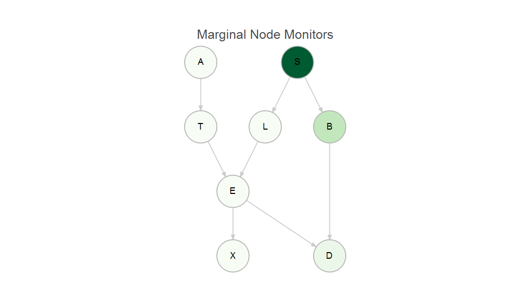
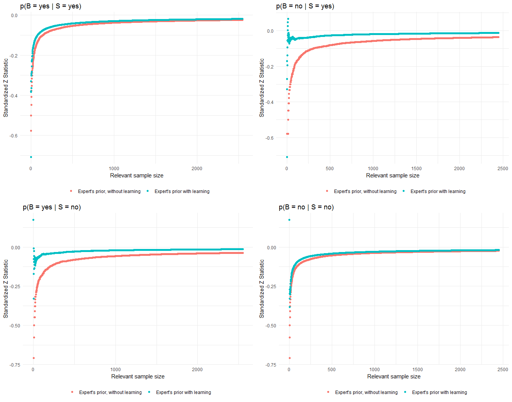

Asia example
================
Rachel Wilkerson
3 May 2019

Prequential diagnostic monitors for Bayesian Networks
-----------------------------------------------------

Package exists to check the goodness of fit for a BN model. Package is designed to interface with objects of class bnlearn.

``` r
devtools::install_github('bnmonitoR','rachwhatsit')
```

Load the package from github.

``` r
library(bnmonitoR)
```

We will examine the dataset from the bnlearn package from Lauritzen. Details of the variables (nodes) can be found in the documentation for bnlearn.

``` r
data(asia)
summary(asia)
```

    ##    A          S          T          L          B          E       
    ##  no :4958   no :2485   no :4956   no :4670   no :2451   no :4630  
    ##  yes:  42   yes:2515   yes:  44   yes: 330   yes:2549   yes: 370  
    ##    X          D       
    ##  no :4431   no :2650  
    ##  yes: 569   yes:2350

We will specify the structure of the model here. This corresponds to the candidate model from Cowell et al. pg 240

``` r
asia.dag = model2network("[A][S][T|A][L|S][B|S][D|B:E][E|T:L][X|E]") #this is the candidate model from pg 240
bnlearn::graphviz.plot(asia.dag) 
```

    ## Loading required namespace: Rgraphviz


### Global monitor

The global monitor is equivalent to the Bayes Factor and offers a good assessment of the model as a whole.

``` r
global.monitor.tbl(asia.dag, alpha = 2, df=asia)
```

    ## Warning: `as_tibble.matrix()` requires a matrix with column names or a `.name_repair` argument. Using compatibility `.name_repair`.
    ## This warning is displayed once per session.

    ## # A tibble: 8 x 2
    ##   V1    node.scores
    ##   <chr>       <dbl>
    ## 1 A          -248. 
    ## 2 B         -3021. 
    ## 3 D         -2144. 
    ## 4 E           -19.6
    ## 5 L         -1100. 
    ## 6 S         -3470. 
    ## 7 T          -258. 
    ## 8 X          -849.

The darker colors correspond to nodes with a greater contribution to the Bayes Factor. \#\#\#\# Global Monitors for Model 1

``` r
global.monitor.graph(asia.dag, alpha = 2, df=asia)
```

    ## Warning: `as_tibble.matrix()` requires a matrix with column names or a `.name_repair` argument. Using compatibility `.name_repair`.
    ## This warning is displayed once per session.


The global monitor is most useful when comparing between models. For instance, following the example from Cowell 1994, Model 0 compares to Model 1 above. Model 0 below has an addition link between smoking and dyspnoea. The effect of this can be seen in the slightly higher contribution of the Bayes factor to node D. This does not have a significant effect on the model as a whole. (Note that the link between S and D is obscure in Model 0 by the layout. I haven't figured a way around this yet.)

``` r
asia.dag.model0 = model2network("[A][S][T|A][L|S][B|S][E|T:L][X|E][D|B:E:S]") #this is the candidate model from pg 240
model0 <- global.monitor.tbl(asia.dag.model0, alpha = 2, df=asia)
model1 <- global.monitor.tbl(asia.dag, alpha = 2, df=asia)

sum(model0$node.scores)/sum(model1$node.scores)#Bayes Factor
```

    ## [1] 1.000798

#### Global Monitors for Model 0

``` r
global.monitor.tbl(asia.dag.model0, alpha = 2, df=asia)
```

    ## # A tibble: 8 x 2
    ##   V1    node.scores
    ##   <chr>       <dbl>
    ## 1 A          -248. 
    ## 2 B         -3021. 
    ## 3 D         -2153. 
    ## 4 E           -19.6
    ## 5 L         -1100. 
    ## 6 S         -3470. 
    ## 7 T          -258. 
    ## 8 X          -849.

``` r
global.monitor.graph(asia.dag.model0, alpha = 2, df=asia)
```


At this point, we're curious about what's happening with nodes S, B, and D. To examine that further, we can check the node monitors.

### Node monitors

Two types of node monitors are calculated: marginal and conditional.

``` r
node.monitor.tbl(asia.dag,asia)
```

    ## # A tibble: 8 x 3
    ##   node  marg.z.score       cond.z.score      
    ##   <chr> <chr>              <chr>             
    ## 1 A     -0.102975857084615 -0.10298623527338 
    ## 2 S     -114.835058113367  -118.794639749989 
    ## 3 T     -0.105418218761077 -0.105428845306493
    ## 4 L     -0.301330305068444 -0.30136486292253 
    ## 5 B     -34.6833789314871  -35.040700180339  
    ## 6 E     -0.322602780192606 -0.322640534442406
    ## 7 X     -0.423420308831507 -0.423478541429205
    ## 8 D     -10.4048396933113  -10.3678670531485

This plot, confirms that the overall incidence for Smoking, Bronchitis, and Dysnopea is poorly modelled. Because there is very little difference between the marginal and conditional nodes, the graphs in this example are virtually indistinguishable.We only plot the marginal monitor below.

``` r
marg.node.monitor.graph(asia.dag,asia)
```



### Parent child monitor

To investigate further into the problem nodes, we can examine how the model is performing for each set of parent and child nodes. Smoking is a root node, so here we'll investigate Bronchitis.

This data is simulated, so these are pretty neat on the whole. We see that the model at first overestimate the cases of Bronchitis for smokers, but quickly learns. This function computes the predictive probabilities for observing the particular combinations of parent and child values.

``` r
plot1 <- seq.pa.ch.monitor(dframe=asia, dag=asia.dag, node.name="B", pa.names = "S", pa.val = 'yes',node.val="yes")
plot2 <- seq.pa.ch.monitor(dframe=asia, dag=asia.dag, node.name="B", pa.names = "S", pa.val = 'yes',node.val="no")
plot3 <- seq.pa.ch.monitor(dframe=asia, dag=asia.dag, node.name="B", pa.names = "S", pa.val = 'no',node.val="yes")
plot4 <- seq.pa.ch.monitor(dframe=asia, dag=asia.dag, node.name="B", pa.names = "S", pa.val = 'no',node.val="no")
grid.arrange(plot1, plot2, plot3, plot4,ncol=2)
```


